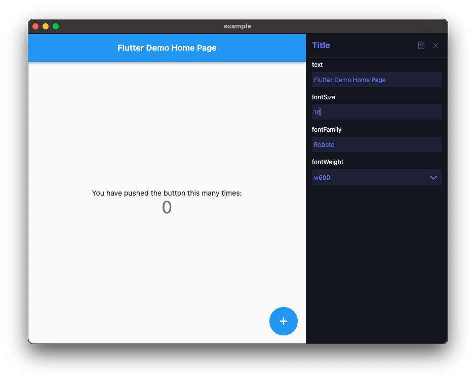

# Knobs

Define custom panel for updating a set of properties.



## Quickstart

Setup the editor area where the panel opens which will contains `Knobs` as descendents :

```dart
MaterialApp(
    builder: (context, child) => KnobsEditor(child: child!),
    // ...
)
```

Define a customizable area as a `Knobs` widget instance :

```dart
Knobs(
    name: 'Title',
    properties: [
        Property<String>('text', widget.title),
        const Property<double>('fontSize', 12),
        const Property<String>('fontFamily', 'Roboto'),
        Property<FontWeight>.enumOptions('fontWeight', FontWeight.values),
    ],
    documentation: (context, data) => '''This is a doc example.''',
    builder: (context, _) => GestureDetector(
        onTap: () => Knobs.showEditor(context),
        child: Text(
                // `context.knobs.read<String>('text')` can also be used for children widgets
                data.read<String>('text'), 
                style: TextStyle(
                fontSize: data.read<double>('fontSize'),
                fontFamily: data.read<String>('fontFamily'),
                fontWeight: data.read<FontWeight>('fontWeight'),
            ),
        ),
    ),
),
```

## Usage

Supported property types :

* `String`
* `double`
* `bool`
* Options with a set of predefined values any type (*with an helper for enums*).